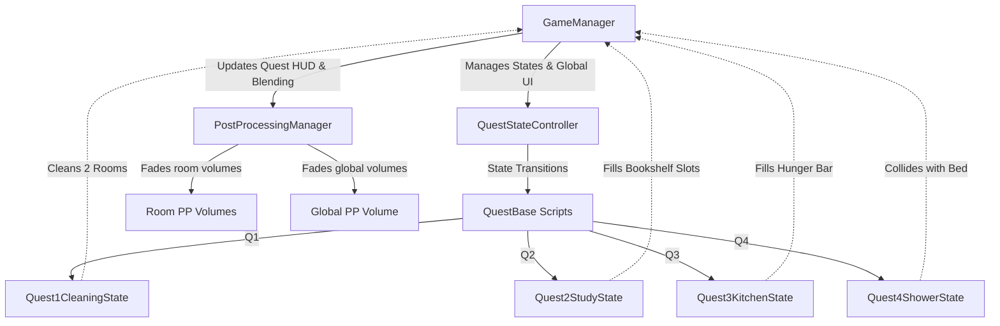

# Burn_out_Loop - Refined VR Implementation Plan

This implementation plan defines the complete architecture, features, and step-by-step implementation for the **Burn_out_Loop** VR experience. This plan is designed to be highly SOLID, modular, and optimized for smooth runtime performance on **Meta Quest 3**.

---

## SOLID Architecture & System Overview

To achieve a robust VR structure, the project will be driven by a centralized **State-Machine Lifecycle** combined with clean, decoupled managers:

### 1. State-Driven Game Lifecycle
*   **`QuestBase.cs`**: An abstract `MonoBehaviour` base class. This allows concrete quests to be edited directly in the Unity Inspector, making it easy to reference UI, particle systems, and audio.
*   **`QuestStateController.cs`**: Manages which quest state is active. It initializes quests and transitions between them (`Q1 -> Q2 -> Q3 -> Q4 -> Credits`).
*   **`GameManager.cs`**: Central coordinator. It holds the reference to the player's controllers/hands and manages global game transitions.

### 2. Hand-Parented Quest UI (Immersive HUD)
*   **Quest UI Canvas**: Placed directly in World Space, scaled down, and parented close to the **Player's Hand Controllers** (e.g. Left/Right Wrist or Controller).
*   It displays:
    1.  **Quest Status Text** (updates dynamically: `"Q1 - Clean up..."`, `"Q2 - Study"`, etc.)
    2.  **Hunger Slider Bar** (Quest 3)
    3.  **Fake Health / Countdown Timer** (Quest 4)
*   This keeps the UI naturally attached to the VR player's body and avoids floating static canvases in empty space.

### 3. Post-Processing & LUT Fader
*   **`PostProcessingManager.cs`**: Standardizes volume weight transitions in URP. 
*   It exposes a public Lerp function: `BlendVolume(Volume volume, float targetWeight, float duration)`.
*   Uses Coroutines to perform smooth, GPU-friendly weight blending.

---

## Feature-by-Feature Implementation & Steps

### Feature 1: Core Framework (Managers & Hand UI)
We will establish the central game state, hand-controller parenting systems, and smooth Post-Processing faders.

*   **Step 1.1: Quest Abstract Base & Controller**
    *   Create `QuestBase.cs` containing virtual lifecycles: `BeginQuest()`, `UpdateQuest()`, `EndQuest()`.
    *   Create `QuestStateController.cs` to hold references to all Quests and run transitions.
*   **Step 1.2: Central GameManager & Wrist UI Setup**
    *   Create `GameManager.cs` to coordinate startup.
    *   Define properties to reference Player Hand Transforms. At runtime, the GameManager will parent the UI Canvas to the specified hand controller.
    *   Implement the Quest HUD UI updater showing:
        *   `Q1 - Clean up...`
        *   `Q2 - Study`
        *   `Q3 - Snack time!`
        *   `Q4 - Let's shower...`
*   **Step 1.3: URP Volume Blending**
    *   Create `PostProcessingManager.cs` to smoothly transition room and global volumes using coroutines to avoid garbage collection and ensure a high frame rate on Meta Quest 3.

---

### Feature 2: Quest 1 - Clutter Cleanup & Persistent Spawning
Cleaning up clutter improves the atmosphere. Interacting with an object spawns 10 objects in other rooms. Even after Q1 ends, the spawning and room-clearing effect persists when players touch remaining clutter.

*   **Step 2.1: Refactor Clutter Spawner**
    *   Modify `ClutterSpawner.cs` to trigger when player interacts with it.
    *   Integrate with **Meta Interaction SDK**: Expose a Unity Event (e.g. `OnInteractedWith`) that hooks into Meta's `Grabbable` select events or a simple VR physical trigger.
    *   On interaction:
        1.  Disappear from the current room.
        2.  Query `RoomClutterManager` to spawn 10 clutter instances randomly distributed across designated spawn points in *other* rooms.
        3.  Notify its local `RoomClutterManager` that it was removed.
        4.  *Crucial:* Ensure that the spawner remains active and operational even after Quest 1 has ended, maintaining consistent gameplay logic.
*   **Step 2.2: Room-Specific Clutter Managers**
    *   Create `RoomClutterManager.cs` for tracking clutter in individual rooms.
    *   We will place multiple instances in the scene hierarchy with custom names (e.g., `Bedroom_ClutterManager`, `Kitchen_ClutterManager`, `LivingRoom_ClutterManager`).
    *   Expose:
        *   `string roomName`
        *   `Volume roomVolume` (the local URP volume with the pastel/clean profile)
        *   `Transform[] otherRoomSpawnPoints` (where objects spawn if clutter here is touched)
    *   When the local clutter count in a room drops to 0, it calls `PostProcessingManager` to smoothly transition the room's local URP Volume weight from Noir to pastel CleanLUT.
*   **Step 2.3: Implement Quest 1 State**
    *   Create `Quest1CleaningState.cs`. It listens to room completion events. Once 2 rooms are clean, Q1 completes and transitions to Q2.

---

### Feature 3: Quest 2 - Book Spawning & High-Polish Shelf Snapping
Moving to study, touching a book spawns 10 books near the player, which must be placed in shelf sockets.

*   **Step 3.1: Initial Book & Spawner**
    *   Create `BookSpawner.cs`. When the player touches/grabs the initial book:
        1.  Spawns 10 books with a radial layout around the player's position.
        2.  The spawned books have physical rigids and interactable grabbables.
*   **Step 3.2: High-Polish Shelf Trigger Snapping**
    *   Create `ShelfContainer.cs` attached to the bookshelf.
    *   It will manage an array of small, invisible volume cubes (`Collider[] bookSlots`) set as triggers with their `MeshRenderer` components disabled in the editor.
    *   **Snapping Mechanism Steps**:
        1.  Create a custom `BookSocket.cs` script attached to each invisible cube.
        2.  When a book collider enters the trigger:
            *   Listen for the player releasing the grab (e.g., using Meta's `Grabbable.WhenSelectExited` or checking when no longer grabbed).
            *   Disable the book's `Rigidbody` and Meta grabbable interactors.
            *   Animate the book smoothly (via Lerp) to match the exact position and rotation of the trigger cube.
            *   Parent the book to the slot to keep the scene hierarchy clean.
            *   Mark the slot as occupied.
        3.  `ShelfContainer` monitors how many slots are occupied. When full, Q2 is marked complete.
*   **Step 3.3: Implement Quest 2 State**
    *   Create `Quest2StudyState.cs` to run this quest's state lifecycle.

---

## Feature 4: Quest 3 - Kitchen Cooking & Hand-Parented Hunger Bar
To recover energy, the player must cook and eat food items. The hunger status bar is attached to their wrist/hand controller.

*   **Step 4.1: Hand-Parented Hunger HUD**
    *   Create `HungerBarManager.cs`. Controls the Hand UI's hunger slider.
    *   Provides public functions to increase/decrease hunger and fade the panel in and out.
*   **Step 4.2: Ingredient Spawning & Cooking**
    *   Create `FoodCook.cs` for fridge and stove interaction.
    *   Player interacts with the fridge to receive ingredients.
    *   Player places ingredients on the cooking surface (a small trigger zone).
    *   Cooking takes place: after a 2-second delay with a nice sizzle/cooking particle effect, a consumable food item is spawned.
*   **Step 4.3: Food Consumption & Proximity Dissolve**
    *   Create `FoodConsume.cs` on cooked food.
    *   When the food is consumed (brought close to the player's face trigger or grabbed and clicked):
        1.  Increases hunger by 10% on the `HungerBarManager`.
        2.  Finds all other nearby food items/props using `Physics.OverlapSphere` and calls a smooth scale-down fade to make them disappear.
    *   Once hunger reaches 100% (after eating 10 times), Quest 3 completes.

---

## Feature 5: Quest 4 - Shower Trigger & The Burn Scene
The climax. Showering turns into fire, the room ignites, and the player must dive into the pool-like bed.

*   **Step 5.1: Shower Trigger & Particle Transformation**
    *   Create `ShowerTrigger.cs`.
    *   When player enters the shower volume trigger:
        1.  Spills a water particle system.
        2.  After 3 seconds, replaces the water particles with fire/flame particles.
        3.  Triggers the global volume transition to the monochrome/contrast **Fire LUT**.
        4.  Swaps the bed material to the blue water/pool material.
*   **Step 5.2: Wrist Countdown Timer HUD**
    *   Fades in a fake health/countdown timer panel on the hand-parented HUD.
    *   The timer counts down steadily (representing burning time).
*   **Step 5.3: Bed Collision & Credits**
    *   Create `BedRecoveryTrigger.cs` on the Bed.
    *   When the player collides with the bed:
        1.  Stops the countdown timer immediately.
        2.  Fades the hand HUD out.
        3.  Launches a gorgeous world-space Credits Canvas in VR space, ending the experience.
*   **Step 5.4: Implement Quest 4 State**
    *   Create `Quest4ShowerState.cs` to run this climax phase.

---

## Meta Quest 3 & VR Interaction Compatibility

To ensure full compatibility with the **Meta Interaction SDK** (used for Meta Quest 3 prototyping):
1.  All grabbable / interactable scripts will expose public `UnityEvents` (e.g. `OnGrab()`, `OnRelease()`, `OnInteract()`).
2.  In the Unity Editor, you can wire these events directly to Meta's interaction events (e.g., matching the `WhenSelectExited` event to our `OnRelease` callback).
3.  Trigger colliders will use standard `OnTriggerEnter` filtering for the `"Player"` tag, ensuring physical triggers work perfectly alongside hand grabbables.

---

## Proposed File Changes

These are the exact scripts that will be created under `Assets/Scripts/`:

### Architecture & Managers
#### [NEW] [QuestBase.cs](file:///d:/Repository/Burn_out_Loop/Assets/Scripts/QuestBase.cs)
Abstract class defining quest lifecycle states (`BeginQuest()`, `UpdateQuest()`, `EndQuest()`).
#### [NEW] [QuestStateController.cs](file:///d:/Repository/Burn_out_Loop/Assets/Scripts/QuestStateController.cs)
State controller managing active `QuestBase` states and transitions.
#### [NEW] [GameManager.cs](file:///d:/Repository/Burn_out_Loop/Assets/Scripts/GameManager.cs)
Manages game startup, player hand transforms, and parents the Quest UI panel to the hand.
#### [NEW] [PostProcessingManager.cs](file:///d:/Repository/Burn_out_Loop/Assets/Scripts/PostProcessingManager.cs)
Performs smooth, high-performance URP volume weight fades.

### Quest 1 (Cleaning)
#### [MODIFY] [ClutterSpawner.cs](file:///d:/Repository/Burn_out_Loop/Assets/Scripts/ClutterSpawner.cs)
Modified to support spawning in other rooms, room-clutter notifications, and persistent post-Quest 1 functionality.
#### [NEW] [RoomClutterManager.cs](file:///d:/Repository/Burn_out_Loop/Assets/Scripts/RoomClutterManager.cs)
Configurable room script tracker (placed as `Bedroom_ClutterManager`, etc.) to blend local LUTs.

### Quest 2 (Study)
#### [NEW] [BookSpawner.cs](file:///d:/Repository/Burn_out_Loop/Assets/Scripts/BookSpawner.cs)
Spawns 10 physical grabbable books around the player when the study phase starts.
#### [NEW] [BookSocket.cs](file:///d:/Repository/Burn_out_Loop/Assets/Scripts/BookSocket.cs)
Script on the invisible trigger cubes that handles smooth snapping and parenting of books upon release.
#### [NEW] [ShelfContainer.cs](file:///d:/Repository/Burn_out_Loop/Assets/Scripts/ShelfContainer.cs)
Tracks the number of snapped books and triggers Quest 2 completion.

### Quest 3 (Kitchen)
#### [NEW] [HungerBarManager.cs](file:///d:/Repository/Burn_out_Loop/Assets/Scripts/HungerBarManager.cs)
Controls the hand-parented hunger bar UI panel.
#### [NEW] [FoodCook.cs](file:///d:/Repository/Burn_out_Loop/Assets/Scripts/FoodCook.cs)
Handles fridge ingredient spawning and stove cooking logic.
#### [NEW] [FoodConsume.cs](file:///d:/Repository/Burn_out_Loop/Assets/Scripts/FoodConsume.cs)
Handles eating, increasing hunger, and calling the proximity-dissolve of nearby ingredients.

### Quest 4 (Shower & Burn)
#### [NEW] [ShowerTrigger.cs](file:///d:/Repository/Burn_out_Loop/Assets/Scripts/ShowerTrigger.cs)
Coordinates shower water-to-fire particles, Fire LUT blend, and wrist countdown timer initialization.
#### [NEW] [BedRecoveryTrigger.cs](file:///d:/Repository/Burn_out_Loop/Assets/Scripts/BedRecoveryTrigger.cs)
Detects bed collision, terminates the timer, and fades in the final Credits.

---

## Verification Plan

### C# Compiler & Unity Assembly Checks
*   Verify that all C# scripts compile with zero compile errors or warnings.
*   Ensure tooltips are configured on all serialized properties for intuitive Unity Inspector customization.

### Live Testing & Log Validation
We will use clear console logs to print transitions so you can easily track and debug the game state in real-time inside the headset:
*   `[QuestManager] Initializing Hand-Parented Quest UI Panel.`
*   `[QuestManager] Active Quest: Q1 - Clean up...`
*   `[Bedroom_ClutterManager] Bedroom fully clean! Fading room volume to pastel CleanLUT.`
*   `[QuestManager] Quest 1 complete (2 rooms clean). Transitioning to Q2 - Study.`
*   `[ShelfContainer] Book snapped into Slot 1. Count: 1/10.`
*   `[QuestManager] Quest 2 complete. Transitioning to Q3 - Snack time!.`
*   `[HungerBar] Food consumed. Hunger: 10/100%.`
*   `[QuestManager] Quest 3 complete. Transitioning to Q4 - Let's shower...`
*   `[ShowerTrigger] Shower activated. Water turning to fire! Health countdown running on wrist.`
*   `[BedRecovery] Bed collision detected! Player safe. Loading credits...`
